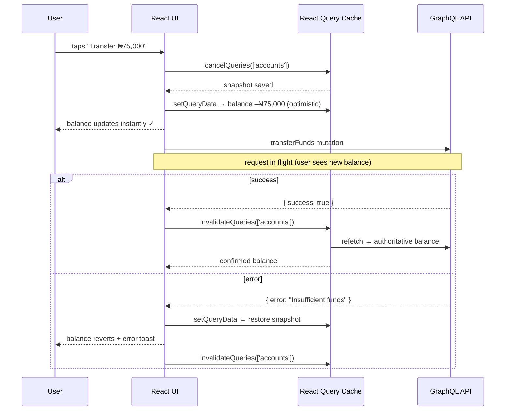

# 004: Idempotency and Optimistic Updates for Financial Mutations

- **Date**: 2026-05-14
- **Status**: accepted

## Context

Financial operations like transfers must never be duplicated and should provide instant feedback to users.

## Decision

- **Client-generated idempotency key** (`crypto.randomUUID()`) sent with every `transferFunds` mutation.
- **Optimistic update pattern** using React Query’s `onMutate`, `onError`, `onSettled`.
- **Retry disabled** for mutations (`retry: false`) – network failures require explicit user retry, not automatic ones.

## Alternatives Considered

- Server-generated idempotency keys – adds a round-trip, not suitable for instant feedback.
- Apollo Client’s optimistic response – tightly coupled to GraphQL; React Query’s approach is backend-agnostic and gives explicit cache control.

## Optimistic update lifecycle

Optimistic updates give instant feedback. The snapshot ensures rollback is always available. <code>onSettled</code> always refetches — the server's answer is the final truth.

## Consequences

- Frontend must handle rollback logic carefully; snapshot integrity is critical.
- Backend must store idempotency keys with a TTL.

<h4>Engineering Stories</h4>
<ul>
<li><a href="../stories/sams-double-transfer">Sam's Double Transfer — idempotency keys</a></li>
<li><a href="../stories/the-optimistic-chef">The Optimistic Chef — optimistic updates & rollback</a></li>
</ul>

<h4>Interview Prep</h4>
<ul>
<li><a href="../interview/system-design">System Design — handling duplicate submissions</a></li>
<li><a href="../interview/react-architecture">React Architecture — optimistic updates failure modes</a></li>
</ul>

<h4>Related ADRs</h4>
<ul>
<li><a href="./008-ledger-first-data-model">ADR 008 — Ledger-First Data Model</a></li>
<li><a href="./006-failure-system">ADR 006 — Failure Simulation & Resilience</a></li>
</ul>

