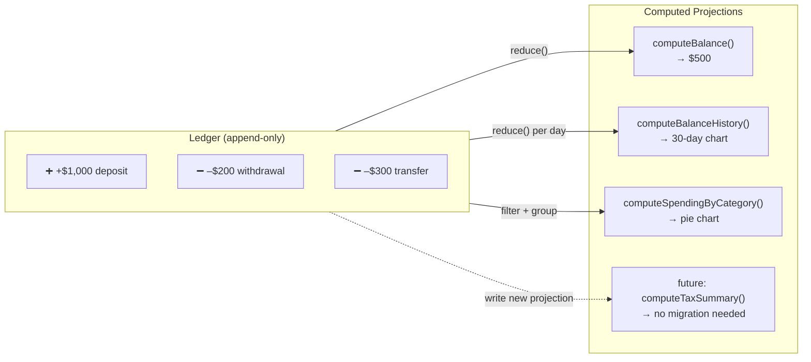

# Ledger-First Data Model

---

## Context

Every financial application needs to display balances. The simplest approach is to store a `balance` column on the account record and update it with every transaction. This is what most demo projects do.

The problem with stored balances in financial systems is not performance — it is **correctness and auditability**. A stored balance is a derived value being treated as a source of truth. When the balance and the transaction history disagree, there is no way to determine which is correct without an audit.

Real banking systems, payment processors, and financial platforms do not store balances. They store every credit and debit, then compute the balance on demand. The balance is a projection, not a record.

---

## The core difference

<div class="stratos-compare">
<div class="stratos-compare-bad">
<div class="stratos-compare-label">⚠ Stored State — two independent writes</div>

**accounts table**<br/>
`id: acc_001 · balance: $700`<br/>
mutable — overwritten each transaction

↕ *separate store*

**transactions table**<br/>
`id: txn_001 · amount: –$300`<br/>
independent write — can fail separately

---

**if write 2 fails after write 1:**<br/>
balance $700 · history shows no debit<br/>
*balance and history diverge permanently*
</div>
<div class="stratos-compare-good">
<div class="stratos-compare-label">✓ Event Sourced — one source of truth</div>

**ledger_entries** · append-only · immutable<br/>
`+$1,000 deposit 2024-01-01`<br/>
`–$200 withdrawal 2024-01-03`<br/>
`–$300 transfer 2024-01-15`

↓ *reduce()*

**computed views** · always consistent<br/>
`balance: $500 · history: 3 entries`<br/>
analytics · tax summary · audit log

---

**consistent by construction:**<br/>
balance and history cannot diverge
</div>
</div>



<p class="diagram-caption">All views derive from the same immutable ledger. Adding a new view never changes the data — only the projection function.</p>

## Decision

The single source of truth is an **append-only ledger of `LedgerEntry` records**. No financial value — balance, running total, or aggregate — is stored anywhere. Every value the UI displays is computed from the ledger at query time.

```ts
interface LedgerEntry {
  id:                   string;
  amount:               number;
  currency:             string;
  type:                 'DEPOSIT' | 'WITHDRAWAL' | 'TRANSFER';
  description:          string;
  createdAt:            string;
  sourceAccountId:      string | null;
  destinationAccountId: string | null;
  category?:            string;
}
```

Derived projections:

| Derived value | Function | Used by |
|---|---|---|
| Current balance | `computeBalance(accountId)` | Account widget, transfer form |
| 30-day balance history | `computeBalanceHistory(walletId)` | Dashboard trend chart |
| Spending by category | `computeSpendingByCategory(walletId, start, end)` | Spending breakdown chart |

---

## Why this matters: two failure modes of stored balances

### Failure mode 1: the phantom balance

A transfer mutation applies an optimistic update: balance immediately shows ₦80,000 instead of ₦100,000. The server request fails. Rollback runs. But a race condition causes a WebSocket event to arrive between the mutation failure and the rollback, updating the balance again from a cache.

With a stored balance field, this scenario produces a permanently incorrect balance that is invisible until a user explicitly refreshes or an engineer digs into the logs.

With a ledger-first model, the balance is recomputed from the ledger on every query. Even if the cache is momentarily inconsistent, the next query returns the correct value because the ledger itself is correct. The ledger is the ground truth; the balance is just arithmetic over it.

### Failure mode 2: the audit gap

A financial regulator asks: "What was this account's balance on the 15th of last month?"

With a stored balance, the answer is: "We don't know. We only have the current balance."

With a ledger, the answer is: filter all entries with `createdAt <= '2026-05-15T23:59:59'`, sum credits and debits. The answer is provable and reproducible.

---

## The pattern this implements

This is **event sourcing** applied to the frontend data layer.

In event sourcing:
- The event log is the source of truth (append-only, immutable).
- The current state is a projection (derived, recomputable, discardable).
- New views of the data are new projections — they do not require schema migrations.

In Stratos Wallet:
- The `ledger` array is the event log.
- `computeBalance()`, `computeBalanceHistory()`, `computeSpendingByCategory()` are projections.
- A new analytics feature (e.g., monthly cashflow) is a new projection function — the ledger does not change.

---

## Single wallet registry

A related architectural decision: wallet and account definitions are stored in a single `Map<userId, WalletDef[]>`. There is no secondary array. Every read path — balance computation, balance history, spending breakdown, transfer validation — goes through the same Map.

**Why this matters:** An earlier version had both a static `wallets` array (used by some functions) and the Map (used by others). Dynamic wallets (created after app startup) only appeared in the Map. Balance history searched the static array and returned empty results for all dynamic wallets. The fix was structural: remove the array entirely, so the class of bug is impossible.

This is the broader principle: **use a single data structure per domain, and route all access through it.** Two stores for the same data will eventually diverge.

---

## Alternatives Considered

### Store balance as a derived cache on the Account record

```ts
interface Account {
  id: string;
  balance: number;   // updated on every transaction write
}
```

**Why rejected:** Introduces a consistency problem — the balance field and the transaction history can disagree. Any bug in the update logic produces a silent incorrect balance. Rollback and recovery logic becomes significantly more complex.

### Use a CQRS-style read model

Maintain the ledger as the write model and a pre-computed `AccountBalance` table as the read model. This is common in high-scale financial backends.

**Why not yet:** Appropriate for production systems with millions of accounts where O(n) ledger scans are too slow. For the mock layer of a frontend project, the simplicity of a single ledger without a sync mechanism is the correct tradeoff.

**Migration path when needed:**
1. Add snapshot checkpoints: `{ accountId, balanceAtDate, date }`
2. `computeBalance(accountId)` reads the most recent snapshot and scans only entries after the snapshot date
3. Checkpoints are written periodically (e.g., nightly or after every 1000 entries)

---

## Consequences

**Positive:**
- Any historical balance is reconstructable by replaying ledger entries up to a point in time.
- New analytics features require writing a new projection — not migrating data.
- Balance bugs are detectable: if the balance is wrong, the ledger entries explain why.
- Rollback is free: reverting a transfer is appending a reversal entry, not mutating a stored value.

**Negative:**
- Every balance computation is O(n) in ledger entries per account.
- For a production system with millions of entries, this requires periodic snapshotting.
- The projection functions must be correct — a bug produces wrong balances for all users simultaneously.

---

## Interview discussion points

> "How would you design a balance display that is always accurate, even under network failures and concurrent mutations?"

The answer: "Derive the balance from the transaction log rather than storing it. Use optimistic updates for immediate UI feedback, but recompute from the authoritative ledger on every query. Use a WebSocket to push ledger events so the projection stays fresh. On reconnect, replay missed events using sequence numbers so the projection catches up without a full refetch. The balance the user sees is always provable — it is the sum of all credits minus all debits in the log."

> "What's the difference between your approach and a standard REST API with a balance field?"

"A REST API with a stored balance couples the display to the storage layer. If the storage has a bug, the display has a bug, and there's no independent source of truth to compare against. A ledger-derived balance is independently verifiable: you can recompute it at any time and get the same answer. In regulated financial systems, this auditability is not optional — it is a legal requirement."

<div class="stratos-related">
<h4>Engineering Stories</h4>
<ul>
<li><a href="../stories/nates-missing-thousands">Nate's Missing Thousands — the bug that can't be undone</a></li>
<li><a href="../stories/sams-invisible-bug">Sam's Invisible Bug — when O(n) starts hurting</a></li>
<li><a href="../stories/two-filing-cabinets">The Two Filing Cabinets — single data store</a></li>
</ul>
</div>

<div class="stratos-related">
<h4>Interview Prep</h4>
<ul>
<li><a href="../interview/data-and-state">Data & State Questions</a></li>
<li><a href="../interview/system-design">System Design Questions</a></li>
<li><a href="../interview/behavioural">Behavioural — "Tell me about a hard decision"</a></li>
</ul>
</div>

<div class="stratos-related">
<h4>Related decisions</h4>
<ul>
<li><a href="./websocket-reliability-protocol">WebSocket Reliability Protocol</a></li>
<li><a href="./idempotency-and-optimistic-updates">Idempotency & Optimistic Updates</a></li>
</ul>
</div>
