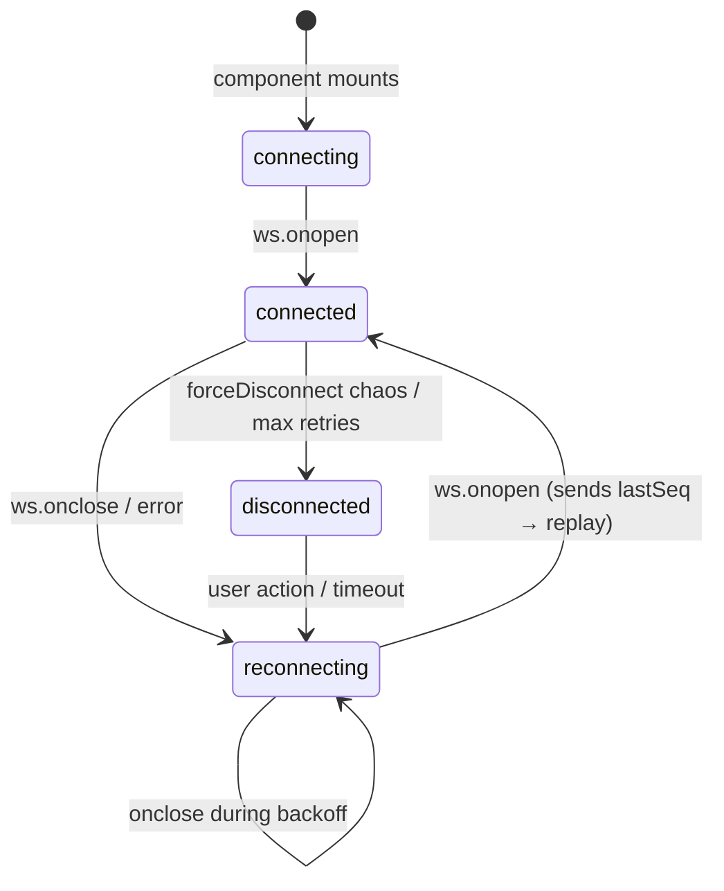

# Real-Time Communication Strategy

---

## Context

The transaction feed and account balances need live updates. A user viewing the dashboard should see a new deposit without refreshing. A user initiating a transfer should see the updated balance reflected immediately after confirmation.

Future features — trade execution, price feeds — require bidirectional communication.

We need to decide:
- What transport to use for real-time events
- What reliability guarantees to provide
- How the client behaves when the connection is lost

---

## Decision

Use **WebSocket** as the primary real-time channel, managed by a custom `useWebSocket` hook.

The hook provides:

1. **Exponential backoff reconnection** — Prevents reconnect storms after outages.
2. **Event deduplication by `eventId`** — Handles at-least-once delivery from the server.
3. **Sequence number tracking** — Detects gaps in the event stream.
4. **Missed-event replay** — On reconnect, sends `lastSeq` so the server can replay missed events.
5. **Connection status** — Exposes `connecting | connected | reconnecting | disconnected` to the UI.

The server assigns every emitted event a monotonically increasing `seq` integer and a unique `eventId` UUID before delivery.

---

## The reliability problem in concrete terms

### Scenario: the bank app during a train ride

A user opens the app on a train. They go through a tunnel. The WebSocket drops. Three transactions process while they are disconnected. The train exits the tunnel and the app reconnects.

**Without sequence numbers:** The app reconnects and continues the event stream from wherever it happens to restart. The three transactions are invisible. The displayed balance is wrong. The user calls support.

**With sequence numbers:** On reconnect, the client sends `{ type: 'subscribe', lastSeq: 1421 }`. The server looks in its event buffer and finds events #1422, #1423, #1424. It replays them in order. The client processes them, the balance is correct, and no interaction was required from the user.

### Scenario: duplicate delivery

The network drops immediately after the server sends event #1422. The server doesn't know the delivery succeeded. When the client reconnects with `lastSeq: 1421`, the server replays #1422 — which the client already processed before the drop.

**Without deduplication:** The transaction appears twice in the feed. The balance is wrong.

**With deduplication:** The client has `eventId: "abc-123"` in its seen-events set. When the replay arrives with the same `eventId`, it is discarded. One transaction, one balance update.

---

## Protocol specification

### Server → Client event envelope

```ts
{
  type:      string;          // 'new_transaction' | 'connected' | 'replay_complete' | etc.
  seq:       number;          // monotonically increasing, global per server instance
  eventId:   string;          // UUID, unique per emission
  replayed?: boolean;         // true when sent as part of a replay sequence
  // ...payload fields
}
```

### Client → Server messages

```ts
// On connection open: subscribe and request replay
{ type: 'subscribe', lastSeq: number }

// Keepalive (every 25 seconds)
{ type: 'ping' }
```

### Server → Client replay response

```ts
// Sent after replaying missed events
{ type: 'replay_complete', replayedCount: number, currentSeq: number }

// Sent when the gap exceeds the server's replay buffer (200 events)
{ type: 'replay_overflow', fromSeq: number, currentSeq: number, message: string }
```

When `replay_overflow` is received, the client must trigger a full REST/GraphQL refetch rather than relying on the replay stream.

---

## Alternatives Considered

### Server-Sent Events (SSE)

A simpler HTTP-based unidirectional stream. The browser natively handles reconnection.

**Advantages:** Simpler server, works through HTTP/2 multiplexing, built-in browser reconnect.

**Why not chosen:** SSE is unidirectional. Once we need bidirectional communication (trade confirmations, admin commands), SSE requires a separate REST channel for client-to-server messages. This produces a split protocol that is harder to reason about.

**When appropriate:** Market data feeds, notifications, and other pure push scenarios where the client never sends data back.

### GraphQL Subscriptions over `graphql-ws`

Runs WebSocket events through the GraphQL schema. Subscriptions are type-safe and co-located with queries and mutations.

**Advantages:** Consistent API surface — everything is GraphQL. Type-safe subscription events via codegen.

**Why not chosen:** Requires a stateful GraphQL server that supports `graphql-ws`. Our mock layer (MSW) handles GraphQL over HTTP but does not implement the `graphql-ws` subprotocol. Implementing this for a mock environment adds complexity without proportional benefit.

**When appropriate:** In production with a real GraphQL server (Apollo Server, Hasura, Pothos). The migration path is: replace the custom WebSocket server with a `graphql-ws` adapter; the client hook adapts to use `graphql-ws/client`.

### Long polling

Repeated HTTP requests at an interval, simulating real-time updates.

**Why not chosen:** Produces unnecessary server load and adds latency equal to the polling interval. Not viable for transaction feeds where timeliness matters.

---

## Consequences

**Positive:**
- True push delivery — no polling overhead.
- Replay protocol handles disconnects gracefully.
- Deduplication makes the system safe for at-least-once delivery.
- Connection status is exposed for UI-level feedback.

**Negative:**
- WebSocket connections require persistent server resources per client.
- The custom reconnection and replay logic adds client-side complexity.
- The replay buffer (200 events) means very long disconnections (>200 events) require a full refetch fallback.
- WebSocket does not work in environments where HTTP proxies strip upgrade headers — requires fallback handling in those cases.

---

## Failure mode table

| Failure | UI Response | Recovery Strategy |
|---|---|---|
| WebSocket disconnect | Status → `reconnecting`, optional banner | Exponential backoff reconnect |
| Missed events (gap < buffer) | Transparent to user | Replay on reconnect via `lastSeq` |
| Missed events (gap > buffer) | Optional "data may be incomplete" notice | `replay_overflow` → full GraphQL refetch |
| Duplicate event | Silent discard | `eventId` deduplication |
| Out-of-order event | Warning logged, event still processed | `seq` comparison |
| Server unreachable | Status → `disconnected` after max retries | Manual refresh or auto-retry after delay |

---

## Connection lifecycle



<p class="diagram-caption">Connection status is exposed to consumers as <code>status: WSConnectionStatus</code> so the UI can show reconnection state without re-implementing tracking.</p>

## Interview discussion points

> "How would you design a real-time balance update system?"

The answer that distinguishes staff-level thinking: "I'd use WebSocket for delivery with at-least-once guarantees, sequence numbers for gap detection, deduplication by event ID for replay safety, and a bounded replay buffer on the server. On reconnect, the client sends its last known sequence and the server replays anything it missed. If the gap exceeds the buffer, the client falls back to a full REST refetch. The UI exposes connection status so the user can see when they're reconnecting — you never silently show potentially stale data without an indicator."

<div class="stratos-related">
<h4>Engineering Stories</h4>
<ul>
<li><a href="../stories/azeez-in-the-tunnel">Azeez in the Tunnel — sequence numbers & replay</a></li>
<li><a href="../stories/jons-duplicate-feed">Jon's Duplicate Feed — deduplication</a></li>
<li><a href="../stories/the-reconnect-storm">The Reconnect Storm — exponential backoff</a></li>
</ul>
</div>

<div class="stratos-related">
<h4>Interview Prep</h4>
<ul>
<li><a href="../interview/real-time">Real-Time Systems Questions</a></li>
</ul>
</div>

<div class="stratos-related">
<h4>Related decisions</h4>
<ul>
<li><a href="./websocket-reliability-protocol">WebSocket Reliability Protocol (implementation)</a></li>
<li><a href="./failure-simulation">Failure Simulation & Resilience System</a></li>
</ul>
</div>
