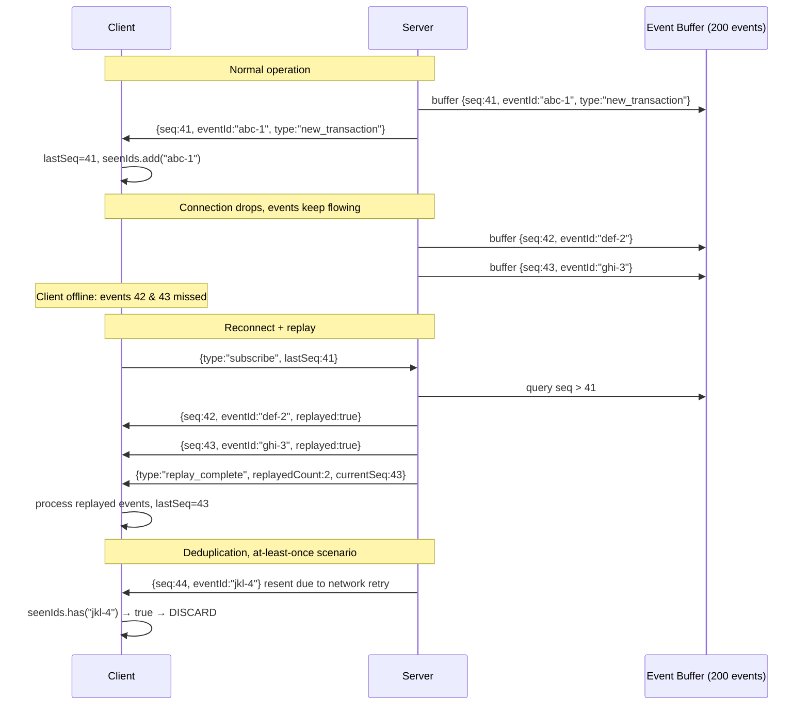

# WebSocket Reliability Protocol

---

## Context

established WebSocket as the real-time transport. The initial `useWebSocket` implementation handled reconnection and chaos simulation, but lacked protocol-level reliability:

1. **No event deduplication.** When `duplicateWsEvents` chaos was enabled, the hook delivered both the original event and the duplicate, doubling every transaction in the feed and corrupting the balance display.

2. **No sequence number tracking.** After a reconnect, the client had no way to know how many events it missed or to request them be replayed. Disconnections silently dropped real-time updates.

3. **No `lastSeq` on reconnect.** The subscribe message was not sent on connection open, so the server had no signal to initiate replay.

4. **Connection status not exposed.** The hook returned only `{ send }`. Consumers (including the UI) had no way to know whether the socket was connecting, connected, or reconnecting without re-implementing the state tracking themselves.

5. **Missing dependency in `useCallback`.** `config.messageReorderRate` was absent from the `connect` dependency array, meaning changes to the reorder chaos setting would not take effect until the next natural reconnect.

---

## Decision

Upgrade both the WebSocket server and the client hook to implement a full reliability protocol.

### Server changes (`server/src/index.ts`)

1. **Global sequence counter.** Every event gets `seq: ++globalSeq`. The counter is monotonically increasing for the server's lifetime.

2. **Unique event IDs.** Every event gets `eventId: crypto.randomUUID()`. Stable per emission: replays carry the same `eventId` as the original, enabling idempotent processing.

3. **Event buffer.** Last 200 events are retained in a ring buffer. Oldest events are evicted when the buffer is full.

4. **Replay on subscribe.** When a client sends `{ type: 'subscribe', lastSeq: N }`:
   - Find all buffered events with `seq > N`.
   - Send them in order with `replayed: true`.
   - Send `replay_complete` when finished.
   - If `N` is older than the oldest buffered event, send `replay_overflow` instead: the client must do a full refetch.

5. **`currentSeq` in welcome message.** The `connected` message includes the server's current sequence so clients know where the stream starts.

### Protocol flow



<p class="diagram-caption">The full reliability lifecycle: normal delivery → disconnect → reconnect with replay → deduplication of a retransmitted event.</p>

### Client changes (`useWebSocket.ts`)

1. **Deduplication window.** A bounded `Set<string>` of recently seen `eventId`s. Size capped at 200. Oldest entry evicted on overflow. On arrival of any event with a known `eventId`: discard, write warning log.

2. **Sequence tracking.** `lastSeqRef` persists across reconnects. On each event: if `seq > lastSeqRef + 1`, log a gap warning. Update `lastSeqRef` to `seq` if greater.

3. **Subscribe on open.** On `ws.onopen`, immediately send `{ type: 'subscribe', lastSeq: lastSeqRef.current }`. This triggers server-side replay of any missed events.

4. **Connection status state.** Exported as `status: WSConnectionStatus`. Values: `'connecting' | 'connected' | 'reconnecting' | 'disconnected'`. Consumers can use this to render reconnection banners or disable interactive elements during degraded states.

5. **`lastSeq` exposed.** Exported as `lastSeq: number`. Enables consumers to show "last synced at seq N" in development panels.

6. **Fixed dependency array.** `messageReorderRate` added to `connect` dependencies. Chaos setting changes now take effect immediately.

7. **Clean unmount.** `ws.onclose = null` is set before closing during unmount. Prevents the close handler from scheduling a reconnect for a component that is no longer mounted.

---

## Design decisions and tradeoffs

### Why a Set for deduplication, not a Map?

A Map would let us store arrival timestamps for TTL-based eviction ("forget events older than 60 seconds"). A Set is simpler and O(1) for both insert and lookup. The bounded-size eviction (remove oldest when full) is a reasonable approximation for short-session deduplication.

**In production:** Use a Map with TTL eviction. The window size should be based on the maximum expected replay latency, not an arbitrary count.

### Why `seq` and `eventId` as separate fields?

They solve different problems. `seq` detects gaps: if you see 41 then 43, you know 42 is missing. `eventId` deduplicates: two deliveries of the same event have the same `eventId` regardless of when they arrive.

You cannot use `seq` for deduplication: a replayed event arrives with its original `seq`, which the client may have already seen and tracked as `lastSeq`. The client needs to know "this is the same event I processed before, not a gap in the sequence."

### Why 200 events in the buffer?

At 5-second event intervals (the server's default transaction rate), 200 events represents ~17 minutes of history. Most transient disconnections (network hiccups, brief offline periods) are shorter than this.

**In production:** The buffer size should be based on your SLA for replay. If your SLA is "clients should recover from disconnections up to 30 minutes old," you need a persistent replay log (a database table, or a Kafka topic with a retention policy), not an in-memory buffer.

### Why exponential backoff with jitter?

Without jitter, all clients that disconnect simultaneously (a server restart) will all retry at the same moment, creating a reconnect storm that overwhelms the restarted server. Random jitter distributes the reconnect load over time.

The formula used:

```
delay = min(1000 * 2^attempt + random(0, 1000), 30_000)
```

| Attempt | Min delay | Max delay |
|---|---|---|
| 0 | 1.0s | 2.0s |
| 1 | 2.0s | 3.0s |
| 2 | 4.0s | 5.0s |
| 3 | 8.0s | 9.0s |
| 4 | 16.0s | 17.0s |
| 5+ | 30.0s | 31.0s |

This pattern is used by AWS SDKs, Stripe's client libraries, and virtually every production real-time system.

---

## Consequences

**Positive:**
- Duplicate events from at-least-once delivery are silently discarded.
- Short disconnections are transparent to the user: events are replayed automatically.
- Sequence gaps are logged, making debugging much easier in production.
- UI can show accurate connection status without reimplementing tracking.

**Negative:**
- The server's in-memory event buffer is lost on restart. After a server restart, clients will receive `replay_overflow` and must do a full refetch.
- The deduplication window (200 events) is a fixed size, not time-based. A slow connection that sees few events might evict older eventIds prematurely.

---

## What this enables next

- UI `reconnecting` banner using `status` from the hook
- Dev panel showing `lastSeq` and gap count
- `replay_overflow` handler that triggers `queryClient.invalidateQueries()`
- Integration tests that verify deduplication and replay under chaos

<div class="stratos-related">
<h4>Engineering Stories</h4>
<ul>
<li><a href="../stories/azeez-in-the-tunnel">Azeez in the Tunnel: sequence numbers & replay</a></li>
<li><a href="../stories/jons-duplicate-feed">Jon's Duplicate Feed: deduplication</a></li>
<li><a href="../stories/the-reconnect-storm">The Reconnect Storm: exponential backoff</a></li>
</ul>
</div>

<div class="stratos-related">
<h4>Interview Prep</h4>
<ul>
<li><a href="../interview/real-time">Real-Time Systems Questions</a></li>
<li><a href="../interview/system-design">System Design: design a real-time balance system</a></li>
</ul>
</div>

<div class="stratos-related">
<h4>Related decisions</h4>
<ul>
<li><a href="./real-time-communication">Real-Time Communication Strategy</a></li>
<li><a href="./failure-simulation">Failure Simulation & Resilience System</a></li>
</ul>
</div>
