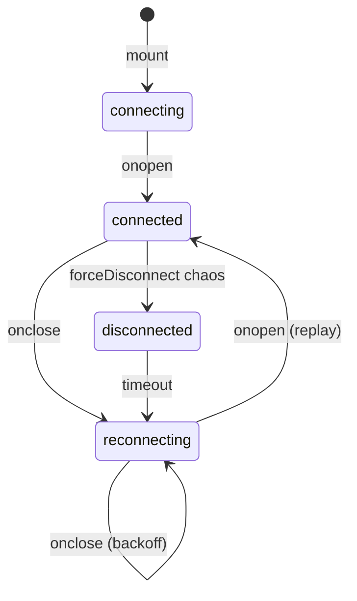

# Architecture

## Overview

Stratos Wallet is organised around three principles:

1. **Vertical slices** — code is grouped by business domain, not by file type.
2. **Contract-first development** — the GraphQL schema is the authoritative interface; components are derived from it, not the other way around.
3. **Ledger as source of truth** — no financial value is stored. Every balance, chart, and metric is computed from an append-only ledger of entries.

These are not stylistic preferences. Each one solves a specific class of problem that grows more expensive as an application scales.

---

## Vertical Slice Architecture

### The problem it solves

A typical React project organised by file type looks like this:

```
src/
  components/
    WalletCard.tsx
    AccountList.tsx
    TransferForm.tsx
    TransactionFeed.tsx
  hooks/
    useWallet.ts
    useAccounts.ts
    useTransactions.ts
  types/
    wallet.ts
    account.ts
    transaction.ts
```

This works at small scale. At medium scale, a change to the transfer feature requires touching `components/`, `hooks/`, and `types/` — three separate trees. At large scale, a senior engineer cannot look at `components/` and understand what business domain any component serves.

Vertical slices solve this by making the business domain the top-level organising principle:

```
src/features/
  transfers/
    TransferPage.tsx        ← component
    transfers.graphql       ← GraphQL operations
    hooks/useTransfer.ts    ← hook
    types.ts                ← types
    __tests__/              ← tests
```

Everything the transfer feature needs is in one folder. A new engineer can read `features/transfers/` and understand the entire transfer domain without navigating three separate trees.

### What each slice owns

| Concern | Owned by |
|---|---|
| Components | The feature that renders them |
| GraphQL operations | The feature that issues them |
| Custom hooks | The feature that uses them |
| Feature-specific types | The feature they describe |
| Tests | The feature they cover |

### The shared kernel

Cross-cutting concerns that no single feature owns belong in `src/shared/`:

```
src/shared/
  hooks/         useWebSocket, useTransactionSubscription
  logger.ts      createLogger() — structured logging with trace IDs
  api/           GraphQL fetcher, query client
  components/    Error boundaries, skeleton loaders
  utils/         Formatters, validators
```

The rule: if two features would need to import from each other, the shared concern belongs in `shared/`. Features never import from other features.

:::info Why the rule matters
Feature-to-feature imports create implicit coupling. When you change the transfer feature's types, you shouldn't have to worry about breaking the accounts feature. The `shared/` boundary makes that guarantee explicit.
:::

---

## Contract-First Development

### The problem it solves

When the UI is built first and the API is added later, the API ends up shaped by what the UI happened to need — not by what the domain actually looks like. This produces APIs that are hard to reuse, hard to version, and impossible to document without reading the source code.

Contract-first reverses the order:

```
1. Define the domain model (what are the core entities?)
2. Write the GraphQL schema  (what operations does the system support?)
3. Generate TypeScript types  (npx graphql-codegen)
4. Implement hooks            (generated React Query hooks from codegen)
5. Build the UI               (components consume the typed hooks)
```

The schema is the contract. It is technology-agnostic: a mobile client, a web client, and a third-party integration all consume the same schema. The UI cannot accidentally work around it.

### GraphQL schema design

The schema separates structure from computation:

```graphql
type Wallet {
  id:    ID!
  label: String!
  accounts: [Account!]!
}

type Account {
  id:          ID!
  name:        String!
  type:        AccountType!
  currency:    String!
  balance:     Float!       # ← computed by resolver, not stored
  lastUpdated: String!
}
```

`Account.balance` looks like a stored field. It is not. The GraphQL resolver calls `computeBalance(accountId)`, which scans the ledger and returns the derived total. The schema exposes the *result* of that computation as a scalar — the client does not need to know how it was computed.

---

## Ledger as Source of Truth

### The financial realism argument

Most demo applications store a `balance` field. Stripe, Coinbase, and every real bank do not. They store every debit and credit in an append-only ledger, then derive the balance on demand.

**Why?**

Because a balance is a *claim about history*. If your ledger says you received ₦50,000 and spent ₦20,000, your balance is ₦30,000 — and that is provable. If you store the balance as a separate number and it shows ₦31,000, you have a consistency bug that requires an audit to detect. Financial institutions are legally required to be able to reconstruct any historical balance, which is only possible if the full history is preserved.

### How it works in this project

```
LedgerEntry[]            ← the single source of truth
  │
  ├── computeBalance(accountId)           → current balance
  ├── computeBalanceHistory(walletId)     → 30-day trend data
  └── computeSpendingByCategory(walletId) → chart data
```

The ledger is an in-memory array in `src/mocks/data.ts`. Every financial operation (deposit, withdrawal, transfer) appends a new `LedgerEntry`. No value is ever mutated — only new entries are added.

Balance history, spending charts, and all analytics are projections: functions that scan the ledger and return a computed view.

### The design pattern this implements

This is **event sourcing** applied to the frontend data layer. The event log (ledger) is immutable. The current state (balance) is a projection of the log.

Advantages:
- Any historical state is reconstructable by replaying entries up to a point in time.
- New analytics features require writing a new projection function, not migrating stored data.
- Bugs in a projection are fixable without data loss.

Tradeoff:
- Every balance computation is O(n) in the number of ledger entries.
- In production, this is solved with periodic snapshots: store a checkpoint balance at time T, then only scan entries after T for current balance.

:::info Interview framing
When an interviewer asks "how would you design a balance display that's always accurate?", the correct answer is not "poll the API every second." It is: "derive the balance from the transaction log, use a WebSocket for real-time updates, and reconcile after reconnection using sequence numbers." This project demonstrates all three.
:::

---

## Real-Time Architecture

### WebSocket reliability protocol

The WebSocket layer is built with three reliability guarantees:

**1. Deduplication by event ID**

Every event the server emits carries a unique `eventId` (UUID). The client maintains a bounded set of recently seen event IDs. When an event arrives, the client checks whether it has been seen:

- If yes: the event is silently discarded. Log entry written.
- If no: the `eventId` is added to the seen set; the event is processed.

This handles at-least-once delivery — a guarantee many real-time systems make: "we will deliver your message, but possibly more than once."

**2. Sequence gap detection**

Every event carries a monotonically increasing `seq` integer. The client tracks `lastSeq`. When an event arrives with `seq > lastSeq + 1`, a gap is detected and logged:

```
[WARN] Sequence gap detected — missed events: { expected: 43, received: 47, missed: 4 }
```

On reconnect, the client sends `{ type: 'subscribe', lastSeq: N }`. The server replays any buffered events with `seq > N`.

**3. Exponential backoff reconnection**

On disconnect, the client waits an increasing delay before reconnecting:

| Attempt | Base delay | With jitter |
|---|---|---|
| 0 | 1s | 1.0–2.0s |
| 1 | 2s | 2.0–3.0s |
| 2 | 4s | 4.0–5.0s |
| 3 | 8s | 8.0–9.0s |
| … | … | … capped at 30s |

The jitter (random 0–1s) prevents reconnect storms: when a server restarts and thousands of clients reconnect simultaneously, staggered jitter distributes those connections over time.

### Connection status lifecycle



---

## State Management

### Three categories of state

| Category | Storage | Example |
|---|---|---|
| **Server state** | React Query cache | Wallet data, account balances, transactions |
| **Global client state** | Zustand | User session, theme |
| **Local UI state** | `useState` | Form inputs, modal open/close |

The rule: **use the most local storage that works**. Form state never belongs in Zustand. Wallet data never belongs in `useState`.

### React Query cache design

Cache keys are namespaced by feature and scoped to their parameters:

```
['wallets']
['accounts', walletId]
['transactions', { accountId, cursor }]
['balance-history', walletId]
['spending-by-category', walletId, startDate, endDate]
```

This enables **targeted invalidation**: a transfer invalidates `['accounts', fromId]` and `['accounts', toId]` without invalidating the transaction feed or balance history.

### Optimistic mutation pattern

Transfers use optimistic updates: the UI reflects the expected result immediately, before the server confirms.

```
onMutate  → snapshot cache, apply optimistic update
onError   → restore snapshot (rollback)
onSettled → invalidate affected cache keys (whether success or failure)
```

This gives users instant feedback while maintaining eventual consistency. The rollback on error ensures the UI never shows a permanently incorrect state.

---

## Chaos Simulation

The application includes a development-only chaos system that simulates realistic failure conditions:

| Preset | Simulates |
|---|---|
| `slow3G` | 800–2500ms latency, 2% error rate |
| `flakyBackend` | 30% error rate, 15% partial responses |
| `websocketStorm` | Duplicate events, 5% message reordering |
| `productionChaos` | All of the above, combined at lower rates |
| `catastrophicFailure` | 80% errors, 50% message drops, forced disconnects |

Every component in the system — GraphQL handlers, WebSocket messages, mutation responses — is routed through `applyChaos()` before being delivered to the UI.

The purpose: build and test every feature under degraded conditions from the start, not after a production incident teaches you about the failure mode.

---

## Observability

### Structured logging

Every subsystem uses `createLogger()` with a feature tag. Every log entry carries a `traceId` so related events across the lifecycle of a user action can be found together:

```ts
const logger = createLogger({ feature: 'websocket' });
logger.warn('Sequence gap detected', { expected: 43, received: 47 });
// → [WARN] [trace:a3f2b1c9] [feature:websocket] Sequence gap detected { expected: 43, received: 47 }
```

In production, these structured entries would ship to a log aggregation platform (Datadog, Sentry, OpenTelemetry). In development, they appear in the browser console with the trace ID as a correlation key.

### Failure observability

Every silent handling decision — duplicate dropped, gap detected, chaos message skipped — writes a log entry. This is what distinguishes a production system from a demo: invisible failures should not stay invisible. They should leave a trace.
